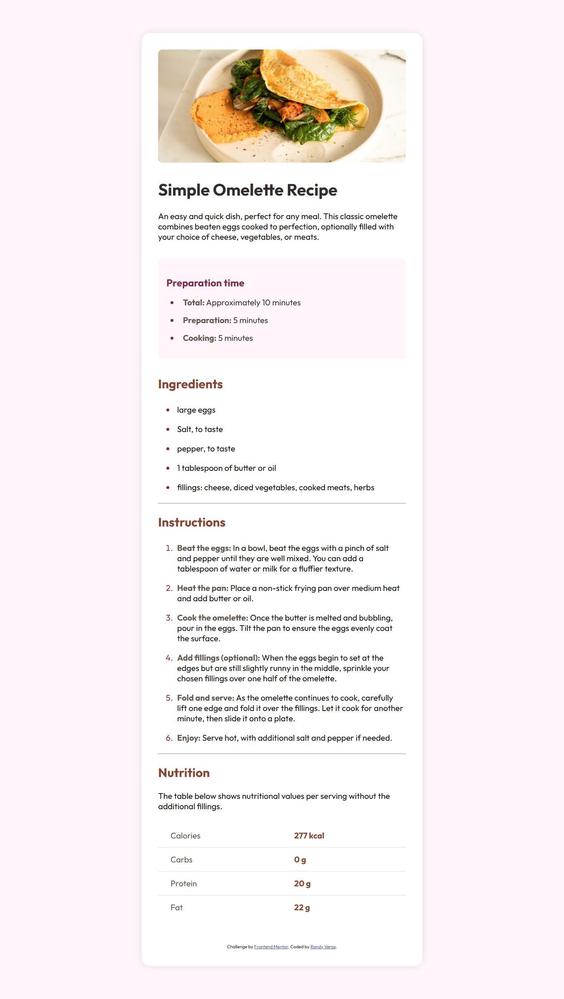

# 🧁 Receta - Tarjeta de Cocina / Recipe Card

Este es un proyecto de tarjeta de receta desarrollado como parte de mi práctica con HTML y CSS. Forma parte de un desafío propuesto por [Frontend Mentor](https://www.frontendmentor.io/), con enfoque en diseño responsivo, tipografía, y maquetación con Flexbox.

This is a recipe card project developed as part of my practice with HTML and CSS. It is based on a challenge from [Frontend Mentor](https://www.frontendmentor.io/), focusing on responsive design, typography, and Flexbox layout.

---

## 📸 Vista previa / Preview

---

## 🚀 Características / Features

- Diseño completamente responsivo (mobile: 375px | desktop: 1440px)  
  Fully responsive design (mobile: 375px | desktop: 1440px)
- Uso de Flexbox para alineación del contenido  
  Uses Flexbox for content alignment
- Tipografías integradas desde Google Fonts  
  Fonts integrated from Google Fonts
- Uso de colores, espaciado y sombras para simular un diseño moderno  
  Use of colors, spacing, and shadows to mimic a modern design
- Estructura semántica (uso de `section`, `main`, `ul/ol`, etc.)  
  Semantic structure (using `section`, `main`, `ul/ol`, etc.)

---

## 🛠️ Tecnologías utilizadas / Technologies Used

- HTML5  
- CSS3 (Flexbox + Media Queries)  
- Google Fonts: [Young Serif](https://fonts.google.com/specimen/Young+Serif) y [Outfit](https://fonts.google.com/specimen/Outfit)  

---

## 📚 Lo que aprendí / What I Learned

- Cómo centrar contenido con Flexbox de forma adaptativa  
  How to center content with Flexbox responsively
- Diferencias entre alinear totalmente al centro vs alineado al tope  
  Differences between fully centering and top-aligned content
- Aplicar fuentes externas y pesos tipográficos específicos  
  Applying external fonts and specific font weights
- Cómo estructurar un diseño basado en tarjetas  
  How to structure a card-based design

---

## 🧠 Retrospectiva / Retrospective

Estoy orgulloso de haber logrado que el diseño se vea bien tanto en móvil como en escritorio. Si volviera a hacerlo, prestaría más atención al espaciado y jerarquía visual desde el inicio para ahorrar tiempo en ajustes.

I’m proud to have achieved a design that looks good on both mobile and desktop. Next time, I would pay more attention to spacing and visual hierarchy early on to save time on adjustments.

---

## ❓ Áreas en las que me gustaría recibir ayuda / Areas Where I’d Like Help

- ¿Mi uso de media queries está bien estructurado para escalar en proyectos más grandes?  
  Is my use of media queries well-structured for scaling to larger projects?
- ¿Mi CSS es legible y mantenible?  
  Is my CSS readable and maintainable?
- ¿Existen mejores prácticas para definir tamaños de fuente (rem vs px)?  
  Are there best practices for defining font sizes (rem vs px)?
- ¿Cómo puedo mejorar la consistencia del espaciado en todo el diseño?  
  How can I improve spacing consistency throughout the design?

---

